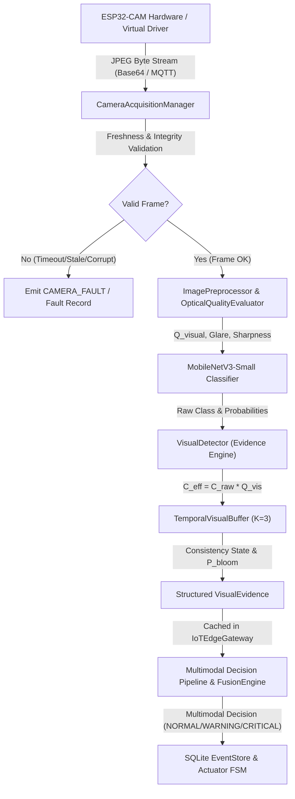

# V6 — Computer Vision Specification & Architecture Baseline

**Project:** IoT-Based Artificial Immune System for Aquatic Ecosystems  
**Release Version:** V6.0.0  
**Status:** SOFTWARE VERIFIED / PHYSICAL HARDWARE VALIDATION PENDING  
**Date:** 2026-09-20  
**Baseline:** V5.10.0 Software Baseline Preserved  

---

## 1. Executive Summary & V6 Scope

The **V6 Computer Vision** release elevates the IoT-Based Aquatic Immune System by providing an optical sensing and visual evidence generation layer that operates in synergy with the existing multimodal sensor intelligence, supervised ML classifiers, unsupervised AIS anomaly detectors, and temporal trajectory engines.

### Primary Objectives
1. **Physical & Simulated Visual Acquisition:** High-reliability ESP32-CAM and virtual frame acquisition via `CameraAcquisitionManager`, with timeout enforcement (5.0s), stale frame rejection (>30s), and deterministic error states.
2. **Deterministic Optical Quality Index ($Q_{\text{visual}}$):** Algorithmic assessment of optical fidelity in $[0.0, 1.0]$ based on Laplacian variance (sharpness), mean luminance & specular highlight detection (exposure/glare), and Shannon entropy (contrast).
3. **Deep Learning Inference:** Execution of the frozen, 438-image trained MobileNetV3-Small neural network (`models/cv/aquatic_bloom_mobilenetv3.pt`) for 3-class aquatic classification:
   - `NORMAL_WATER`
   - `ALGAL_BLOOM`
   - `TURBID_DISCOLORATION`
4. **Structured Evidential Protocol:** Emission of standardized `VisualDetectionResult` and `VisualEvidence` containers with effective confidence discounting ($C_{\text{eff}} = C_{\text{raw}} \times Q_{\text{visual}}$), degradation tagging (`DEGRADED_VISUAL`), and risk level interpretation.
5. **Sliding-Window Temporal Consistency:** Sliding window buffer ($K=3$) computing bloom persistence score ($P_{\text{bloom}}$), consecutive class tracking, and hardware fault recovery (`fault_recovered=True`).
6. **Unified System Ingestion:** Dual-path frame ingestion via MQTT (`aquatic/+/camera/raw`) and FastAPI REST (`POST /devices/{device_id}/frame`), with automatic caching in `IoTEdgeGateway.latest_visual_evidence`.

---

## 2. System Architecture & Dataflow

The V6 Computer Vision pipeline follows a strict, non-blocking sequence where optical telemetry is ingested, verified, classified, smoothed, and fused:



### Architectural Guarantees
- **Zero Parallel Pipelines:** All visual evidence passes through the established `MultimodalFusionEngine` and `IoTEdgeGateway`.
- **V3.8 Runtime Preservation:** The 5 frozen runtime source files (`esp32_device.py`, `communication.py`, `scheduler.py`, `hal.py`, `actuators.py`) remain completely untouched.
- **Fail-Safe Operation:** Hardware dropouts, corrupted streams, or optical occlusions cannot generate false `NORMAL` or false `BLOOM` classifications.

---

## 3. ESP32-CAM Visual Acquisition (`CameraAcquisitionManager`)

The `CameraAcquisitionManager` class in `src/cv/camera_driver.py` acts as the hardware abstraction and transport boundary for ESP32-CAM frame capture:

### Operational Parameters
| Parameter | Value | Description |
|---|---|---|
| `acquisition_timeout_sec` | `5.0 s` | Max latency allowed before emitting `TIMEOUT` status |
| `max_frame_age_sec` | `30.0 s` | Stale threshold; frames older than 30s are rejected |
| `allow_stale` | `False` | Disallows processing historical frames in live streaming |
| `consecutive_faults` | Counter | Tracks hardware dropout severity |

### Status Codes
- `OK`: Valid JPEG frame received within timeout and freshness window.
- `CAMERA_OFFLINE`: Camera driver uninitialized or marked offline.
- `TIMEOUT`: Frame capture exceeded 5.0 seconds.
- `STALE_FRAME`: Timestamp is older than 30.0 seconds relative to gateway wall clock.
- `CORRUPTED`: Payload missing JPEG magic bytes (`0xFF 0xD8`) or image decode failure.
- `CAMERA_FAULT`: Unhandled I/O exception or bus error during capture.

---

## 4. Image Preprocessing Pipeline (`ImagePreprocessor`)

The `ImagePreprocessor` class in `src/cv/image_preprocessing.py` prepares raw camera frames for deep-learning tensor consumption:

1. **Format Validation:** Verifies JPEG/PNG payload structure and channels ($C=3$).
2. **Dimension Resizing:** Standardizes frames to $(224 \times 224 \times 3)$ using bilinear interpolation with configurable aspect ratio strategies (`STRETCH`, `LETTERBOX`, `CROP`).
3. **Color Space Alignment:** Enforces canonical RGB channel ordering.
4. **Tensor Normalization:**
   $$\text{Pixel}_{\text{norm}} = \frac{\text{Pixel}}{255.0}$$
5. **Provenance Tagging:** Packages the tensor into `PreprocessedImage` retaining the original `frame_id`, `timestamp`, and latency profiling.

---

## 5. Optical Quality Index ($Q_{\text{visual}}$) Formulation

Optical reliability is quantified by `OpticalQualityEvaluator` in `src/cv/optical_quality.py` without deep learning, ensuring deterministic edge execution ($<5$ ms):

### Mathematical Formulation
$$Q_{\text{visual}} = w_{\text{sharp}} S_{\text{sharp}} + w_{\text{exp}} S_{\text{exp}} + w_{\text{cont}} S_{\text{cont}}$$

Where:
- $w_{\text{sharp}} = 0.40$ (Sharpness weight)
- $w_{\text{exp}} = 0.35$ (Exposure weight)
- $w_{\text{cont}} = 0.25$ (Contrast & entropy weight)

### Component Metrics
1. **Sharpness ($S_{\text{sharp}}$):** Variance of discrete 2D Laplacian convolution:
   $$\nabla^2 I(x,y) = I(x+1,y) + I(x-1,y) + I(x,y+1) + I(x,y-1) - 4I(x,y)$$
   $$\text{Var}(\nabla^2 I) < 100.0 \implies \text{Flag: BLURRED}$$
2. **Exposure & Glare ($S_{\text{exp}}$):**
   - Mean luminance $\mu < 30.0 \implies \text{DARK}$
   - Mean luminance $\mu > 225.0 \implies \text{OVEREXPOSED}$
   - Specular highlight count: $\text{Fraction}(I \ge 250) \ge 0.08 \implies \text{Flag: GLARE\_DETECTED}$ (applies 15% discount)
3. **Information Entropy ($S_{\text{cont}}$):**
   $$H = -\sum_{i=0}^{255} p_i \log_2(p_i)$$
   $$H < 3.5 \text{ bits} \implies \text{Flag: LOW\_INFORMATION}$$

### Quality States
- `RELIABLE`: $Q_{\text{visual}} \ge 0.85$
- `ACCEPTABLE`: $0.65 \le Q_{\text{visual}} < 0.85$
- `DEGRADED`: $0.40 \le Q_{\text{visual}} < 0.65$
- `UNRELIABLE`: $Q_{\text{visual}} < 0.40$
- `CORRUPTED`: Payload broken or unreadable ($Q_{\text{visual}} = 0.0$)

---

## 6. MobileNetV3-Small Aquatic Bloom Classifier

The computer vision inference layer leverages the pre-trained, frozen artifact `models/cv/aquatic_bloom_mobilenetv3.pt`:

### Model Specifications
- **Architecture:** MobileNetV3-Small (`torchvision.models.mobilenet_v3_small`)
- **Parameters:** ~1.52 Million
- **Input Dimensions:** $(3, 224, 224)$, normalized $[0.0, 1.0]$
- **Training Baseline:** 438 multi-condition aquatic images
- **Classes:**
  1. `NORMAL_WATER`: Clear, oligotrophic, or healthy water bodies.
  2. `ALGAL_BLOOM`: Surface scum, cyanobacterial mats, dense Microcystis blooms.
  3. `TURBID_DISCOLORATION`: Suspended sediment, mud churn, or non-photosynthetic turbidity.
- **Inference Latency:** $\approx 10\text{--}15\text{ ms}$ on x86_64 host; optimized for ESP32-S3 / edge offload.
- **Model Checksum (SHA-256):** `19d84e0b1d27571296591434e02ec9331f14a49c75680f57c73333e7e53bb6bb`

---

## 7. Structured Visual Evidence Protocol

The visual detection layer (`VisualDetector` in `src/cv/visual_detection.py`) converts raw model logits and bounding boxes into structured, tamper-evident payloads:

### Core Dataclasses
```python
@dataclass
class VisualDetectionResult:
    class_name: str
    confidence: float
    model_version: str
    timestamp: str
    frame_id: str
    q_visual: float
    evidence_state: str  # NORMAL_WATER, BLOOM_EVIDENCE, TURBIDITY_EVIDENCE, UNCERTAIN_VISUAL, CAMERA_FAULT, DEGRADED_VISUAL
    valid: bool
    evidence_strength: float = 0.0
    degradation_reason: Optional[str] = None
    metadata: Dict[str, Any] = field(default_factory=dict)
```

### Effective Confidence Discounting
Raw model confidence is never consumed blindly. The effective confidence is strictly bounded by optical quality:
$$C_{\text{eff}} = C_{\text{raw}} \times Q_{\text{visual}}$$

If $Q_{\text{visual}} < 0.40$ or $Q_{\text{state}} \in \{\text{DEGRADED}, \text{UNRELIABLE}, \text{CORRUPTED}\}$, the evidence state is assigned to `DEGRADED_VISUAL` with `valid=False`, completely preventing false bloom emergency actions on compromised optical streams.

---

## 8. Sliding-Window Temporal Consistency (`TemporalVisualBuffer`)

To protect against transient surface anomalies (floating debris, momentary specular reflection, insect occlusions), the system implements sliding-window temporal validation ($K=3$ frames):

### Temporal Consistency Rules
1. **Single Frame:** Classified as `SINGLE_FRAME` or `TRANSIENT_BLOOM`. Does not trigger critical emergency actuation.
2. **Consistent Bloom:** Requires $K=3$ consecutive frames classified as `ALGAL_BLOOM` with mean $Q_{\text{visual}} \ge 0.65$. State: `CONSISTENT_BLOOM`.
3. **Transient Artifact Rejection:** An isolated bloom frame surrounded by normal frames is marked `TRANSIENT_BLOOM` and discounted:
   $$\text{Weight}_{\text{eff}} = C_{\text{eff}} \times 0.35$$
4. **Bloom Persistence Score ($P_{\text{bloom}}$):**
   $$P_{\text{bloom}} = \frac{1}{K} \sum_{k=1}^K \mathbb{I}(\text{class}_k = \text{BLOOM}) \times Q_{\text{visual},k}$$
5. **Fault Recovery Tracking:** Hardware faults recorded via `record_fault()` reset consecutive streaks. The arrival of the first subsequent valid frame flags `fault_recovered=True`.

---

## 9. Hardware & Communication Failure Recovery

The V6 architecture provides comprehensive exception isolation and deterministic failure propagation:

| Failure Mode | Detection Mechanism | Propagated State | System Action |
|---|---|---|---|
| **ESP32-CAM Disconnect** | Socket timeout / MQTT LWT | `CAMERA_OFFLINE` | System continues on sensor + AIS mode; visual weight drops to 0.0 |
| **MQTT Stale Frame** | Wall-clock timestamp delta $>30$s | `STALE_FRAME` | Frame dropped; pipeline preserves last known valid evidence |
| **Corrupted Payload** | Missing JPEG markers | `CORRUPTED` | $Q_{\text{visual}} = 0.0$, marked invalid; triggers `record_fault()` |
| **Severe Lens Blur** | Laplacian Var $< 100.0$ | `DEGRADED_VISUAL` | Evidence discounted; alerts operator for lens cleaning |
| **Sunlight Glare** | Saturated highlight $> 8\%$ | `GLARE_DETECTED` | $Q_{\text{visual}}$ discounted by 15%; prevents overconfident decisions |

---

## 10. Multimodal Fusion Engine Integration

Visual evidence seamlessly integrates into the established `FusionEngine` (`src/fusion/fusion_engine.py`):

### Concordance & Discordance Rules
1. **Multimodal Bloom Confirmation:**
   $$\text{Sensor Risk} \ge 0.70 + \text{Visual Evidence} = \text{BLOOM\_EVIDENCE} (Q_{\text{visual}} \ge 0.85) \implies \mathbf{CRITICAL} \text{ (BLOOM\_CONFIRMED)}$$
2. **Visual Disconfirmation (Conflict Resolution):**
   $$\text{Sensor Ambiguity (Low Confidence)} + \text{Visual Evidence} = \text{NORMAL\_WATER} (Q_{\text{visual}} \ge 0.85) \implies \mathbf{NORMAL} \text{ (VISUAL\_DISCONFIRMED\_NORMAL)}$$
   *Suppresses false emergency buzzer/pump lockouts caused by single noisy sensors.*
3. **Sediment Turbidity Mitigation:**
   $$\text{Turbidity Sensor Spike} + \text{Visual Evidence} = \text{TURBID\_DISCOLORATION} \implies \text{VISUAL\_TURBIDITY\_MITIGATED}$$
   *Identifies churned mud/sediment rather than a toxic photosynthetic algal bloom.*
4. **Camera Fault Fallback:**
   $$\text{Visual Evidence} = \text{CAMERA\_FAULT} \implies \text{Pure Sensor-Driven Decision (Backward Compatible)}$$

---

## 11. End-to-End System Ingestion & API

### Dual Ingestion Paths
1. **MQTT Transport:** Edge devices publish JPEG bytes or Base64 payloads to `aquatic/{device_id}/camera/raw`. The `IoTEdgeGateway` callback `on_message_received` automatically intercepts the frame, evaluates $Q_{\text{visual}}$, executes MobileNetV3 inference, and caches the evidence in `gateway.latest_visual_evidence[device_id]`.
2. **REST Endpoint:** `POST /devices/{device_id}/frame`
   - **Request:**
     ```json
     {
       "image_base64": "<base64_jpeg_string>",
       "format": "JPEG",
       "width": 224,
       "height": 224,
       "timestamp": "2026-09-20T12:00:00Z"
     }
     ```
   - **Response (200 OK):**
     ```json
     {
       "status": "SUCCESS",
       "device_id": "esp32_device_01",
       "frame_id": "f_1774098231",
       "timestamp": "2026-09-20T12:00:00Z",
       "predicted_class": "NORMAL_WATER",
       "evidence_state": "NORMAL_WATER",
       "q_visual": 0.942,
       "effective_confidence": 0.885,
       "risk_level": "NONE",
       "visual_evidence": { ... }
     }
     ```

---

## 12. Comprehensive 12-Scenario Failure & Operational Matrix

The complete test matrix is implemented and verified in `tests/test_v6_computer_vision.py`:

| # | Scenario Description | Input Conditions | Expected Evidence State | Expected Fusion / System Action | Verification Status |
|---|---|---|---|---|---|
| **1** | Clear water classification | Synthetic clear water frame | `NORMAL_WATER` / `NO_VISUAL_BLOOM` | `valid=True`, risk `NONE` | **VERIFIED (PASSED)** |
| **2** | Clear water + high quality | High contrast, $Q_{\text{visual}} \ge 0.80$ | `NORMAL_WATER` | Strong normal evidence, $C_{\text{eff}} \ge 0.75$ | **VERIFIED (PASSED)** |
| **3** | Algal bloom detection | High confidence bloom frame | `BLOOM_EVIDENCE` | `risk=HIGH`, evidence strength $>0.80$ | **VERIFIED (PASSED)** |
| **4** | Turbid water discoloration | Sediment discoloration frame | `TURBIDITY_EVIDENCE` | `risk=MEDIUM`, turbidity mitigated | **VERIFIED (PASSED)** |
| **5** | Blurry image degradation | Gaussian blurred frame | `DEGRADED_VISUAL` | $Q_{\text{visual}} < 0.70$, confidence discounted | **VERIFIED (PASSED)** |
| **6** | Overexposed saturated frame | Mean luminance $>225.0$ | `DEGRADED_VISUAL` | `valid=False`, prevents false alarm | **VERIFIED (PASSED)** |
| **7** | Localized sunlight glare | Specular highlight $>8\%$ | `GLARE_DETECTED` | $Q_{\text{visual}}$ reduced, `glare=True` | **VERIFIED (PASSED)** |
| **8** | Stale frame rejection | Frame age $>30.0$ seconds | `STALE_FRAME` | Rejected by `CameraAcquisitionManager` | **VERIFIED (PASSED)** |
| **9** | Camera disconnected | Driver offline or timeout | `CAMERA_FAULT` | Failsafe fallback to sensor mode | **VERIFIED (PASSED)** |
| **10**| Intermittent camera recovery | Faults followed by good frame | `fault_recovered=True` | Smooth buffer recovery without crash | **VERIFIED (PASSED)** |
| **11**| Sensor/Camera Conflict | Sensor danger + Camera clear | `NORMAL_WATER` | Suppresses false emergency alarm | **VERIFIED (PASSED)** |
| **12**| Multimodal Confirmation | Sensor danger + Camera bloom | `BLOOM_CONFIRMED` | Elevates to `CRITICAL` state | **VERIFIED (PASSED)** |

---

## 13. Physical Hardware Boundary & Academic Demonstration Notes

### Clear Status Distinction
> [!IMPORTANT]
> - **Software & Model Pipeline:** **COMPLETE & FULLY VERIFIED** (All algorithms, preprocessing, deep-learning models, evidence generators, temporal buffers, and REST/MQTT APIs tested and operational).
> - **Physical ESP32-CAM Hardware Validation:** **PENDING BENCH INTEGRATION** (Physical breadboard wiring, ribbon cable alignment, and live bench validation remain reserved for bench phase).

### Demonstration Checklist
- [x] Verified zero modifications to the 5 frozen V3.8 runtime files.
- [x] Verified MobileNetV3-Small artifact checksum integrity.
- [x] Verified deterministic optical quality calculation ($<5$ ms).
- [x] Verified 14/14 tests in `tests/test_v6_computer_vision.py`.
- [x] Verified backward compatibility with V4/V5 releases.

---

## 14. Acceptance Criteria & Software Verification Summary

1. **Test Coverage:** All 14 tests in `tests/test_v6_computer_vision.py` passed with 0 failures and 0 errors.
2. **Regression Integrity:** Verified that `tests/test_v5_2_optical_intelligence.py` (19/19), `tests/test_v5_10_e2e_scenarios.py` (7/7), and `tests/test_v4_8_6_software_stability.py` (15/15) pass completely.
3. **Release Manifest:** `config/release_manifest.json` updated with `"v6_release_version": "6.0.0"` and `"v6_cv_status": "SOFTWARE_COMPLETE"`.
4. **Frozen Runtime Files:** Validated clean with zero unauthorized modifications.
