# V7 — Multimodal Intelligence Specification & Architecture Baseline

**Project:** IoT-Based Artificial Immune System for Aquatic Ecosystems  
**Release Version:** V7.0.0  
**Status:** SOFTWARE COMPLETE & VERIFIED / PHYSICAL MULTIMODAL HARDWARE: PENDING  
**Date:** 2026-09-20  
**Baseline:** V6.0.0 (Preserved & Verified) | V3.8 Frozen Embedded Runtime (Zero Touches)  

---

## 1. Executive Summary & V7 Scope

The **V7 Multimodal Intelligence** release establishes a unified multi-stream sensory and cognitive reasoning engine that synthesizes heterogeneous intelligence vectors across:
1. **Sensor & Supervised ML Intelligence:** Hydrochemical probe readings (pH, Dissolved Oxygen, Temperature, Turbidity, Conductivity) processed by supervised Random Forest / Gradient Boosting classifiers (`caml_phase3_champion`, `habsos_phase3_champion`).
2. **Optical & Deep Learning Intelligence:** ESP32-CAM and virtual optical frames evaluated by the Laplacian/Luminance/Entropy Quality Evaluator and classified by the 438-image trained MobileNetV3-Small neural network (`aquatic_bloom_mobilenetv3.pt`).
3. **Adaptive Artificial Immune System (AIS):** Negative Selection Algorithm (`caml_nsa_v1_adaptive`, `habsos_nsa_v1_adaptive`) detecting biological and chemical anomalies via affinity radius matching in non-self feature space.
4. **Temporal Trajectory Intelligence:** Multi-rate sliding window velocity, acceleration, and trend analysis (`V5.3`).
5. **Historical Digital Baselines:** Diurnal and seasonal historical reference baselines (`V5.7/V5.8`).

### Core Multimodal Objectives
- **Temporal Alignment & Common Protocol:** Formulate a uniform `MultimodalEvidenceItem` contract across all 5 streams with dynamic staleness decay ($F \in [0.1, 1.0]$) and maximum allowable skew enforcement ($\Delta T \le 60\,\text{s}$).
- **Cross-Modality Concordance Assessment:** Compute pairwise agreement matrices and an aggregate concordance score ($S_{\text{agree}} \in [0.0, 1.0]$) to establish ecological confidence.
- **Cross-Modality Conflict Classification & Resolution:** Detect and conservatively arbitrate conflicting sensory reports (e.g., optical algae detected vs. clear water sensor readings, or high turbidity caused by sediment vs. organic bloom) using deterministic resolution strategies.
- **Single-Modality Dominance Prevention:** Prevent single uncorroborated or degraded probes from triggering false emergency activations or deploying costly chemical/aeration interventions.
- **Transparent Explainability & Unified Telemetry:** Emit explainable rationale, publish to `aquatic/{device_id}/multimodal`, persist to SQLite `multimodal_events`, expose via FastAPI `/devices/{device_id}/multimodal`, and render on the Streamlit Dashboard Tab 6.

---

## 2. System Architecture & Multimodal Dataflow

The V7 Multimodal pipeline operates synchronously inside `MultimodalFusionEngine.fuse()`, receiving evidence items from upstream pipelines:

```mermaid
graph TD
    S["1. Sensor / Supervised ML"] -->|"adapt_sensor_evidence"| ALIGN["TemporalAlignmentEngine"]
    V["2. Optical / MobileNetV3"] -->|"adapt_visual_evidence"| ALIGN
    T["3. Temporal Trajectory"] -->|"adapt_temporal_evidence"| ALIGN
    A["4. Adaptive AIS NSA"] -->|"adapt_ais_evidence"| ALIGN
    H["5. Historical Baseline"] -->|"adapt_historical_evidence"| ALIGN

    ALIGN -->|"Synchronized & Freshness-Weighted"| SNAP["MultimodalSnapshot"]
    
    SNAP --> CONC["ConcordanceEngine"]
    SNAP --> CONF["ConflictDetector"]
    
    CONC -->|"Pairwise Agreement Score"| EST["MultimodalStateEstimator"]
    CONF -->|"Conflict Type & Action"| EST
    
    EST -->|"State, Confidence, Dominance Check"| RES["MultimodalStateResult"]
    RES --> FUSION["MultimodalFusionEngine (v7.0.0)"]
    FUSION --> XAI["ExplainabilityEngine (XAI)"]
    FUSION --> STORE["SQLite EventStore (multimodal_events)"]
    FUSION --> MQTT["MQTT (aquatic/{id}/multimodal)"]
    FUSION --> REST["FastAPI (/devices/{id}/multimodal)"]
    FUSION --> DASH["Streamlit Dashboard (Tab 6: Multimodal)"]
```



---

## 3. Multimodal Evidence Alignment Layer

Implemented in `src/fusion/multimodal_alignment.py`.

### 3.1 Common Evidence Contract (`MultimodalEvidenceItem`)
Every stream produces a standardized item:
```python
@dataclass
class MultimodalEvidenceItem:
    modality: str                  # "sensor_ml", "visual", "temporal", "ais", "historical"
    timestamp: str                 # ISO-8601 UTC timestamp
    state: str                     # "NORMAL", "WATCH", "EARLY_WARNING", "CRITICAL_INTERVENTION", etc.
    raw_confidence: float          # [0.0, 1.0]
    quality_index: float           # [0.0, 1.0] (e.g., Q_visual or sensor SNR)
    effective_confidence: float    # raw_confidence * quality_index
    freshness: float               # [0.1, 1.0] computed by TemporalAlignmentEngine
    age_seconds: float             # delta against snapshot reference timestamp
    status: str                    # "CURRENT", "STALE", "EXPIRED", "MISSING", "DEGRADED"
    valid: bool                    # True if confidence > 0 and quality >= threshold
    degradation_reason: Optional[str]
    metadata: Dict[str, Any]
```

### 3.2 Dynamic Freshness Decay
Freshness $F(t)$ decreases as age $\Delta t$ increases relative to the reference timestamp:
$$F(\Delta t) = \begin{cases} 
1.0 & \text{if } \Delta t \le 10\,\text{s} \text{ (CURRENT)} \\
1.0 - 0.5 \times \frac{\Delta t - 10}{50} & \text{if } 10\,\text{s} < \Delta t \le 60\,\text{s} \text{ (STALE)} \\
0.1 & \text{if } \Delta t > 60\,\text{s} \text{ (EXPIRED)}
\end{cases}$$

If optical quality $Q_{\text{visual}} < 0.60$, the visual item is marked `valid = False` with `degradation_reason = "Optical quality severely degraded"`.

### 3.3 Multimodal Snapshot Container (`MultimodalSnapshot`)
Aggregates the items into an immutable snapshot:
- Tracks `valid_count`, `missing_modalities`, and `degraded_modalities`.
- Computes `max_time_skew_seconds`. If $\Delta t_{\text{max}} > 60\,\text{s}$, `alignment_status` is flagged as `EXCESSIVE_SKEW`.
- Provides deterministic fallback for offline, missing, or corrupt streams.

---

## 4. Cross-Modality Concordance Engine

Implemented in `src/fusion/multimodal_intelligence.py` (`ConcordanceEngine`).

### 4.1 Concordance Calculation
For all pairs of valid modalities $(i, j)$:
1. **Severity Distance:** Map states to numeric severity levels:
   $$\text{SEVERITY} = \{\text{NORMAL}: 0, \text{WATCH}: 1, \text{EARLY_WARNING}: 2, \text{CRITICAL_INTERVENTION}: 3\}$$
2. **Pairwise Agreement:**
   $$A_{ij} = \max\left(0.0, 1.0 - 0.4 \times |\text{sev}_i - \text{sev}_j|\right)$$
3. **Weighted Aggregate Score:**
   $$S_{\text{agree}} = \frac{\sum_{i < j} w_i w_j A_{ij}}{\sum_{i < j} w_i w_j}$$
   where weight $w_i = C_{\text{eff}, i} \times F_i$.

### 4.2 Concordance Status Thresholds
| Concordance Score ($S_{\text{agree}}$) | Status | System Action |
|---|---|---|
| $S_{\text{agree}} \ge 0.70$ | `HIGH_CONCORDANCE` | Full trust in synthesized estimate |
| $0.40 \le S_{\text{agree}} < 0.70$ | `MODERATE_CONCORDANCE` | Cautious synthesis, apply conservative clamp |
| $S_{\text{agree}} < 0.40$ | `DIVERGENT` | Sensory divergence, trigger conflict resolution |

---

## 5. Cross-Modality Conflict Engine & Resolution Matrix

Implemented in `src/fusion/multimodal_intelligence.py` (`ConflictDetector`).

### 5.1 Conflict Classification
| Conflict Type | Sensory Condition | Prescriptive Resolution Strategy |
|---|---|---|
| `NONE` | All modalities agree or within 1 severity level | Retain standard synthesized state |
| `SENSOR_VS_VISION` | Sensors flag threat ($\ge \text{EARLY_WARNING}$) while Vision confirms `NORMAL_WATER` with $Q_{\text{visual}} \ge 0.65$ | `SUPPRESS_EMERGENCY`: Suppress false alarm, clamp state to `WATCH`, request optical re-scan |
| `TURBIDITY_VS_SEDIMENT` | High turbidity reported, but Vision detects non-green sediment/turbid water and DO/pH are normal | `DOWNGRADE_WATCH`: Prevent false algal bloom trigger, classify as abiotic turbidity |
| `AIS_NOVELTY_VS_SENSORS` | Adaptive AIS reports anomaly ($d < R$), but ML and Vision report `NORMAL` | `FLAG_NOVELTY_AUDIT`: Maintain `WATCH`, flag unknown biological/chemical compound for review |
| `TEMPORAL_DIVERGENCE` | Instantaneous readings show threat, but temporal trend/acceleration is negative or static | `AVERAGE_DISCOUNT`: Discount transient spikes, monitor multi-cycle velocity |
| `MULTIPLE_CONFLICTS` | Two or more simultaneous conflict patterns detected | `CONSERVATIVE_CLAMP`: Clamp to lowest confident non-critical state (`WATCH`) |

---

## 6. Synthesized State Estimation & Dominance Prevention

Implemented in `src/fusion/multimodal_intelligence.py` (`MultimodalStateEstimator`).

### 6.1 Single-Modality Dominance Prevention
A critical ecological safeguard:
> **Rule:** If exactly ONE modality flags a threat (`EARLY_WARNING`, `HIGH_RISK`, `BLOOM_CONFIRMED`) and that modality is degraded ($Q < 0.70$), stale ($F < 0.80$), or actively in conflict with other modalities:
> - `dominance_prevented = True`
> - Provisional state is clamped to `EARLY_WARNING` or `WATCH`.
> - Actuator emergency protocols (`CRITICAL_INTERVENTION`) are blocked.
> - An auditable governance reason is recorded in telemetry.

### 6.2 Synthesized State Confidence
The overall multimodal confidence is calculated as:
$$C_{\text{multimodal}} = \left(\frac{\sum_i w_i C_{\text{eff}, i}}{\sum_i w_i}\right) \times \left(0.6 + 0.4 \times S_{\text{agree}}\right) \times (1.0 - \text{conflict\_penalty})$$
where $\text{conflict\_penalty} = 0.25$ if severe conflict is present, $0.10$ if minor conflict, $0.0$ otherwise.

---

## 7. Storage, API, and Dashboard Integration

### 7.1 SQLite Schema (`multimodal_events`)
Created in `src/iot/event_store.py`:
```sql
CREATE TABLE IF NOT EXISTS multimodal_events (
    id INTEGER PRIMARY KEY AUTOINCREMENT,
    timestamp TEXT NOT NULL,
    device_id TEXT NOT NULL,
    synthesized_state TEXT NOT NULL,
    confidence REAL NOT NULL,
    concordance_score REAL NOT NULL,
    concordance_status TEXT NOT NULL,
    conflict_detected INTEGER NOT NULL,
    conflict_type TEXT NOT NULL,
    conflict_action TEXT NOT NULL,
    dominance_prevented INTEGER NOT NULL,
    valid_modalities INTEGER NOT NULL,
    snapshot_json TEXT NOT NULL
);
CREATE INDEX IF NOT EXISTS idx_mm_device_ts ON multimodal_events(device_id, timestamp);
```

### 7.2 Communication Topics & REST Endpoints
- **MQTT Topic:** `aquatic/{device_id}/multimodal`
- **FastAPI Endpoints:**
  - `GET /devices/{device_id}/multimodal`: Returns the latest synchronized multimodal intelligence record.
  - `GET /devices/{device_id}/intelligence`: Augmented with V7 multimodal snapshot, concordance, conflict, and state estimation.

### 7.3 Streamlit Dashboard Tab 6 (`🌐 V7 Multimodal Intelligence`)
Located in `dashboard/app.py`:
1. **Multimodal State & Concordance Metric Cards:** Displays Synthesized Ecological State, Multi-stream Concordance Score, Alignment Status, and Conflict Diagnostics.
2. **Dominance Governance Card:** Real-time indicator showing if single-probe runaway was prevented.
3. **Synchronized Modality Snapshot Table:** Tabular inspection of all 5 modalities (State, Raw Conf, Quality, Freshness, Age, Validity, Degradation Reason).
4. **Pairwise Concordance Matrix:** Interactive heatmap/table showing inter-modality agreement coefficients.
5. **Historical Multimodal Audits:** Time-series of past multimodal synthesis events.

---

## 8. Architectural Integrity & Verification

1. **V3.8 Frozen Embedded Core:**
   The five foundational files remain untouched (0 lines modified):
   - `src/iot/esp32_device.py`
   - `src/iot/communication.py`
   - `src/iot/scheduler.py`
   - `src/iot/hal.py`
   - `src/iot/actuators.py`
2. **Regression Baseline:**
   All 394 prior tests (V1–V6.0) pass with 0 failures and 3 skipped.
3. **V7 Verification Suite:**
   20 comprehensive integration and unit test scenarios in `tests/test_v7_multimodal_intelligence.py` pass with 100% success rate.
4. **Total Repository Test Suite:**
   **414 passed, 0 failed, 3 skipped** in 31.58 seconds.
5. **System Acceptance Testing (SAT):**
   Full 200-cycle stress test passed at 13.78 cycles/sec with 0 errors.
6. **Physical Hardware Boundary:**
   Software and algorithmic pipelines are 100% complete and verified. Physical bench wiring and dual-device multimodal field testing are documented as `PENDING PHYSICAL BENCH WIRING`.
