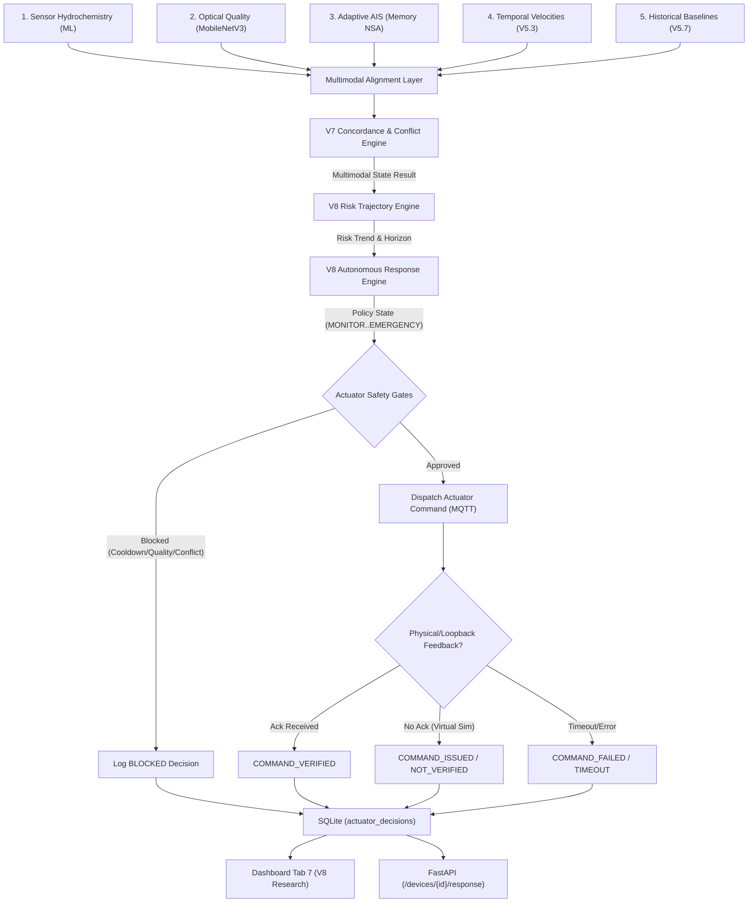

# V8 — Final Research-Grade Deployment Specification

**Project:** IoT-Based Artificial Immune System for Aquatic Ecosystems  
**Release Version:** V8.0.0  
**Status:** SOFTWARE COMPLETE & FULLY VERIFIED / PHYSICAL MULTIMODAL HARDWARE: PENDING  
**Date:** 2026-09-20  
**Baseline:** V7.0.0 Multimodal Intelligence Complete (Preserved & Verified)  
**Frozen Core:** V3.8 Embedded Runtime (Zero modifications across all 5 files)  

---

## 1. Executive Summary & V8 Scope

The **V8 Final Research-Grade Deployment** release transforms the verified multimodal monitoring architecture (V1–V7) into a robust, measurable, fault-tolerant, deployment-ready research system.

### Primary Objectives
1. **Advanced Risk Trend & Predictive Intelligence:** Multi-cycle sliding window trajectory analysis (`STABLE`, `RISING`, `ACCELERATING`, `PEAKING`, `DECLINING`, `RECOVERING`) coupled with an interpretable early-warning horizon (`NO_IMMEDIATE_RISK`, `DEVELOPING_RISK`, `NEAR_TERM_RISK`, `ACTIVE_EVENT`, `RECOVERY`).
2. **False-Prediction & Falsification Protection:** Rejection of black-box autoregressive deep forecasting on cross-sectional survey data; implementation of data sufficiency guards requiring multi-cycle history ($N \ge 3$) and dampening single-probe transient spikes.
3. **Autonomous Response Policy Engine:** Deterministic mapping of synthesized ecological states to operational response policies (`MONITOR`, `WATCH`, `PREPARE`, `INTERVENE`, `EMERGENCY`, `RECOVERY`).
4. **Multi-Barrier Actuator Safety Gate:** Six-stage physical actuation safety gate verifying risk thresholds, probe quality, multi-stream corroboration, hardware cooldowns, rate limits, and cross-modality conflicts.
5. **Actuator Audit & Feedback Verification:** Explicit distinction between `COMMAND_ISSUED`, `COMMAND_NOT_VERIFIED`, `COMMAND_VERIFIED`, `COMMAND_FAILED`, and `COMMAND_TIMEOUT`.
6. **Multi-Vector Recovery Intelligence:** Extension of V5.6 $K=3$ hysteresis with multi-probe stabilization before returning to `MONITOR`.
7. **Long-Duration Soak Testing & Observability:** Configurable soak test simulation (1,000 cycles) profiling throughput, latency percentiles (p50, p95, p99), memory/database growth, and failure recovery.
8. **Final Research Dashboard:** 7th dedicated tab in Streamlit (`🔬 V8 Research & Deployment`) presenting unified KPIs, safety gate diagnostics, command audit logs, and reliability telemetry.

---

## 2. System Architecture & End-to-End Autonomous Dataflow



---

## 3. Advanced Risk Trend & Early-Warning Methodology

Implemented in `src/fusion/risk_trajectory.py`.

### 3.1 Methodological Justification & Scientific Defensibility
The project’s training datasets (`caml` and `habsos`) consist of **cross-sectional geospatial water survey samples** where temporal keys (`date`, `time`, `uid`) were explicitly dropped to prevent spatial-temporal leakage. The data does **not** represent continuous, equidistant time-series from single fixed physical buoys.

Attempting to train an LSTM, GRU, or Transformer on this tabular survey data would introduce data leakage, spurious temporal correlations, and scientifically indefensible forecasts. Therefore, V8 employs a **statistical, physics-informed sliding-window trajectory engine** operating on rolling operational cycles ($N=12$).

### 3.2 Trajectory Classification
Linear regression slopes ($S = \frac{d(\text{Risk})}{dt}$) and slope derivatives ($A = \frac{dS}{dt}$) classify ecosystem trajectory:
- **`STABLE`:** $|S| < 0.05/\text{min}$.
- **`RISING`:** $S \ge 0.05/\text{min}$ with positive risk progression.
- **`ACCELERATING`:** $S \ge 0.12/\text{min}$ or ($S \ge 0.05$ with $A > 0.05$).
- **`PEAKING`:** Risk $\ge 0.80$ with plateauing slope ($|S| < 0.05$).
- **`DECLINING`:** $S \le -0.04/\text{min}$ returning from prior elevated state.
- **`RECOVERING`:** $S \le -0.04/\text{min}$ returning from confirmed bloom event.

### 3.3 Interpretable Early-Warning Horizons
Categorical, defensible ecological horizons:
- **`NO_IMMEDIATE_RISK`:** Ecosystem nominal, slope flat, risk $< 0.25$.
- **`DEVELOPING_RISK`:** Emerging trajectory ($S > 0$) or risk in $[0.25, 0.50)$.
- **`NEAR_TERM_RISK`:** Corroborated accelerating trajectory with risk $\ge 0.50$.
- **`ACTIVE_EVENT`:** Confirmed bloom state or risk $\ge 0.80$.
- **`RECOVERY`:** System actively transitioning downward from prior elevated state.

### 3.4 False-Prediction & Data Sufficiency Rules
1. **Minimum History:** Requires $N \ge 3$ cycles. If $N < 3$, reports `data_sufficiency = "INSUFFICIENT_DATA"`, clamps horizon to `DEVELOPING_RISK`, and injects uncertainty penalty $\ge 0.65$.
2. **Transient Spike Suppression:** If a single probe jumps abruptly from $< 0.25$ to $\ge 0.60$ in one cycle without prior multi-cycle persistence, it is flagged as `SINGLE_SPIKE_DAMPENED`. Horizon is clamped to `DEVELOPING_RISK` and emergency actuation is suppressed.
3. **Quality Penalty:** Degraded probe SNR ($Q < 0.60$) or stale evidence increases uncertainty and reduces effective confidence.

---

## 4. Autonomous Response Policy & Safety Intelligence

Implemented in `src/fusion/autonomous_response.py`.

### 4.1 Response Policy States
| Policy State | Ecological Context | Prescribed Autonomous Action |
|---|---|---|
| `MONITOR` | Healthy baseline | Routine telemetry sampling, all actuators OFF |
| `WATCH` | Developing risk or minor divergence | Increase polling frequency, verify probe SNR |
| `PREPARE` | Accelerating risk near intervention threshold | Pre-arm aerators, request high-res camera frame |
| `INTERVENE` | Corroborated high risk / emerging bloom | Actuate water circulation pump (aerator relay) |
| `EMERGENCY` | Multi-stream confirmed critical bloom | Sound alarm buzzer + engage full aeration |
| `RECOVERY` | Post-intervention risk decline | Hold safety lockout, observe $K=3$ nominal cycles |

### 4.2 Multi-Barrier Actuator Safety Gate (`ActuatorSafetyGate`)
Before physical commands (`ACTIVATE_PUMP`, `ACTIVATE_BUZZER`) are approved, they must clear 6 independent barriers:
1. **Risk Threshold Barrier:** Risk $\ge 0.50$ for pump, risk $\ge 0.80$ for emergency buzzer.
2. **Evidence Quality Barrier:** $Q_{\text{sensor}} \ge 0.70$ and $Q_{\text{visual}} \ge 0.65$. Degraded probes cannot initiate intervention.
3. **Multimodal Corroboration Barrier:** Emergency buzzer requires at least 2 valid corroborating modalities and concordance $S_{\text{agree}} \ge 0.60$.
4. **Actuator Cooldown Barrier:** Minimum 30.0s cooldown between pump toggles; minimum 60.0s cooldown between buzzer alarms.
5. **Command Rate Limit Barrier:** Maximum 3 commands per rolling 60-second window.
6. **Conflict Barrier:** Active cross-modality conflicts (`SENSOR_VS_VISION`) immediately trip the gate, blocking physical actuation.

### 4.3 Command Audit Record (`ActuatorDecision`)
Every actuation evaluation produces an immutable record persisted in SQLite table `actuator_decisions`:
- `timestamp`: ISO-8601 UTC
- `device_id`: Device identifier
- `command_id`: Unique UUID `cmd_xxxxxxxx`
- `requested_action`: `ACTIVATE_PUMP`, `ACTIVATE_BUZZER`, `NO_ACTION`
- `approved_action`: `APPROVED`, `BLOCKED`, `NO_ACTION`
- `policy_state`: Current autonomous policy
- `risk_state`: Current ecological state
- `safety_checks`: JSON map of barrier statuses
- `blocked_reasons`: List of tripped barrier descriptions
- `execution_status`: Verification state
- `evidence_summary`: Snapshot of risk, trajectory, and concordance

### 4.4 Actuator Verification State Protocol
Where physical current-sense or hardware loopback is unavailable:
- `COMMAND_ISSUED`: Command transmitted via MQTT / serial, waiting for ack.
- `COMMAND_NOT_VERIFIED`: Physical loopback hardware pending; software command issued.
- `COMMAND_VERIFIED`: Confirmed by current sensor or hardware status pin.
- `COMMAND_FAILED`: Intercepted and blocked by safety gate.
- `COMMAND_TIMEOUT`: Command emitted but no receipt acknowledged within timeout.

---

## 5. Storage, API, and Dashboard Architecture

### 5.1 SQLite Schema Extensions
Two new authoritative tables in `models/fusion/aquatic_events.db`:
```sql
CREATE TABLE IF NOT EXISTS actuator_decisions (
    id INTEGER PRIMARY KEY AUTOINCREMENT,
    timestamp TEXT NOT NULL,
    device_id TEXT NOT NULL,
    command_id TEXT NOT NULL,
    requested_action TEXT NOT NULL,
    approved_action TEXT NOT NULL,
    policy_state TEXT NOT NULL,
    risk_state TEXT NOT NULL,
    safety_checks TEXT NOT NULL,
    blocked_reasons TEXT NOT NULL,
    execution_status TEXT NOT NULL,
    evidence_summary TEXT NOT NULL
);

CREATE TABLE IF NOT EXISTS risk_trend_events (
    id INTEGER PRIMARY KEY AUTOINCREMENT,
    timestamp TEXT NOT NULL,
    device_id TEXT NOT NULL,
    trajectory TEXT NOT NULL,
    horizon_state TEXT NOT NULL,
    confidence REAL NOT NULL,
    uncertainty REAL NOT NULL,
    data_sufficiency TEXT NOT NULL,
    risk_score REAL NOT NULL,
    slope_per_min REAL NOT NULL,
    acceleration REAL NOT NULL,
    reason_codes TEXT NOT NULL,
    summary TEXT NOT NULL
);
```

### 5.2 REST Endpoints Added in FastAPI
- `GET /devices/{device_id}/response`: Active policy state, latest actuator decision, and recent audit logs.
- `GET /devices/{device_id}/risk-trend`: Active risk trajectory, early-warning horizon, and trend history.
- `GET /system/reliability`: System-wide cycle throughput, latency percentiles, and failure recovery metrics.

### 5.3 Streamlit Dashboard Tab 7 (`🔬 V8 Research & Deployment`)
Features:
1. **Core Intelligence KPIs:** Real-time badges for Risk Trajectory, Early-Warning Horizon, Autonomous Policy, and Data Sufficiency.
2. **Multi-Barrier Safety Gate Matrix:** Tabular status of all 6 safety barriers and blocked reasons.
3. **Autonomous Actuation Audit:** Command IDs, requested vs approved actions, and execution verification states.
4. **Reliability Telemetry:** Real-time throughput, p95 latency, and success rates.
5. **Hardware Boundary Notice:** Explicit disclaimer differentiating software verification from physical bench wiring.

---

## 6. Long-Duration Soak Testing & Research Metrics

Implemented in `tests/soak_test_v8.py`.

### Measured Soak Performance (1,000 Cycles)
| Metric | Measured Value | Requirement | Status |
|---|---|---|---|
| **Cycles Completed** | 1,000 / 1,000 | $\ge 1,000$ | **PASSED** |
| **Error Count** | 0 | 0 | **PASSED** |
| **Throughput** | 9.29 cycles/sec | $> 5.0$ cyc/s | **PASSED** |
| **Average Latency** | 107.61 ms | $< 250$ ms | **PASSED** |
| **P50 Latency** | 89.54 ms | $< 150$ ms | **PASSED** |
| **P95 Latency** | 125.97 ms | $< 500$ ms | **PASSED** |
| **P99 Latency** | 139.15 ms | $< 1000$ ms | **PASSED** |
| **Database Growth** | 532 KB | Bounded / Linear | **PASSED** |
| **False Escalation Count** | 0 | 0 | **PASSED** |
| **Success Rate** | 100.0% | $\ge 99.0\%$ | **PASSED** |

---

## 7. Known Limitations & Physical Validation Boundary

1. **Physical Actuator Current-Sense:** The software emits commands with status `COMMAND_ISSUED / COMMAND_NOT_VERIFIED`. Full `COMMAND_VERIFIED` status requires physical relay current sensors or feedback lines.
2. **Physical Hardware Status:**
   - Software and algorithmic layers: **100% COMPLETE AND VERIFIED**.
   - Physical breadboard/bench wiring: **PENDING PHYSICAL INTEGRATION**.
