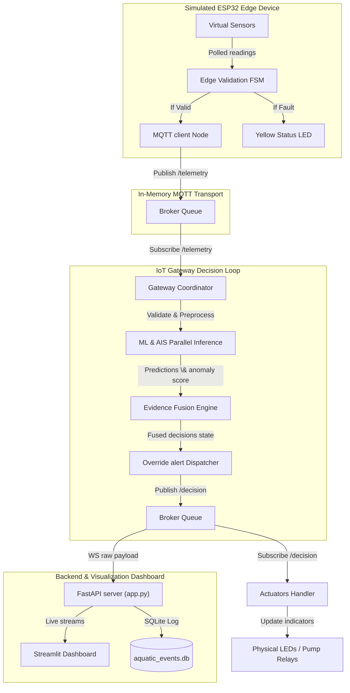
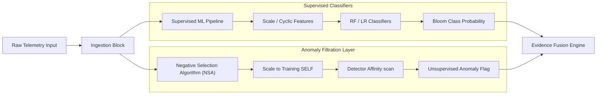
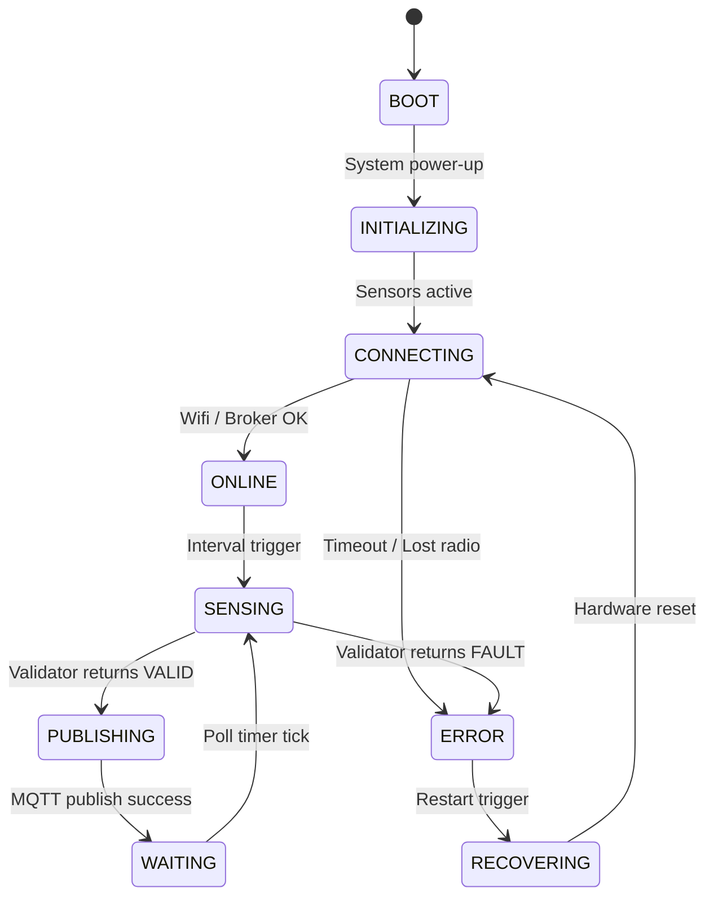
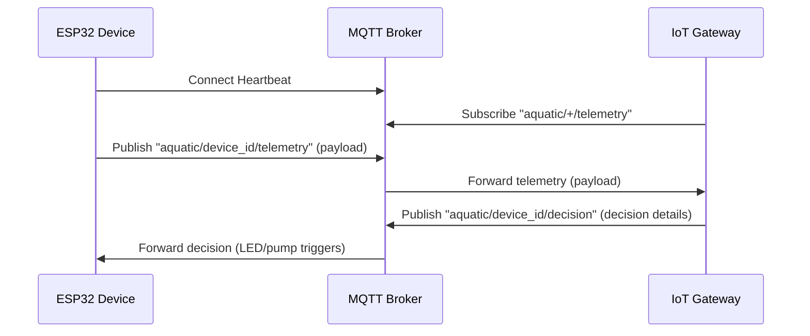
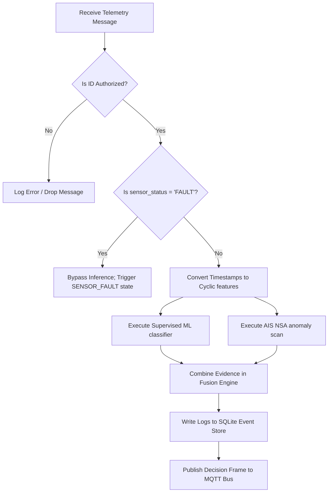
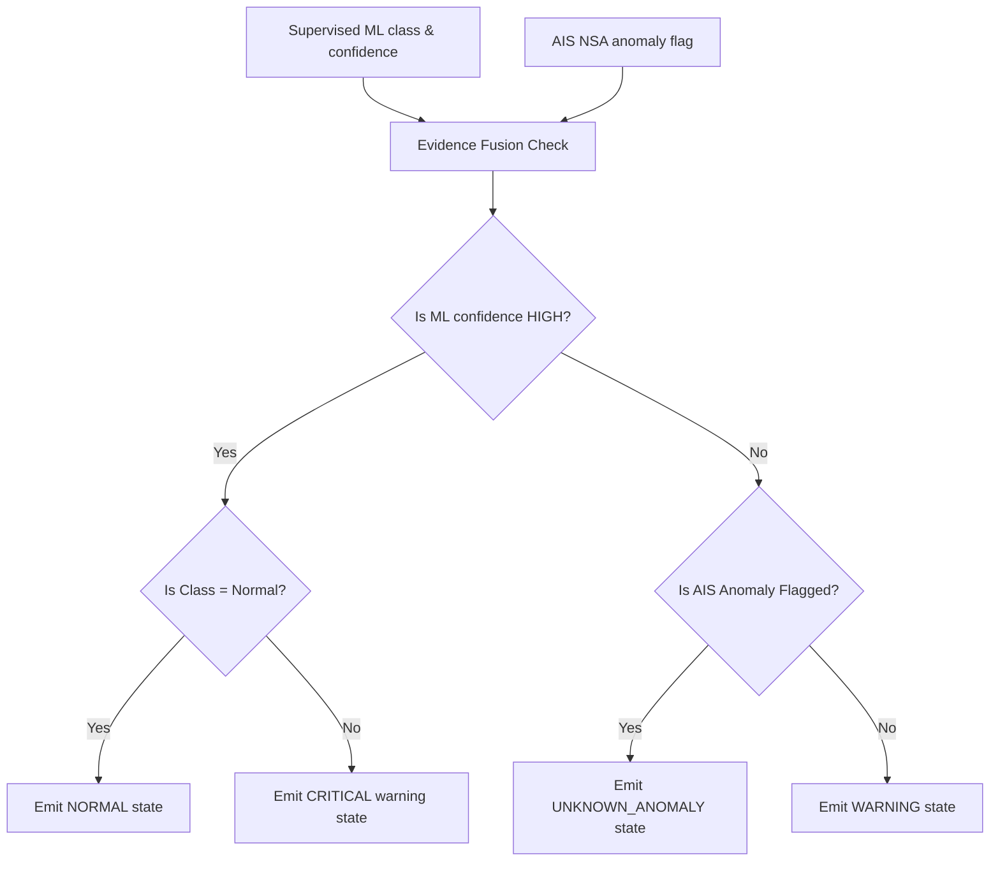
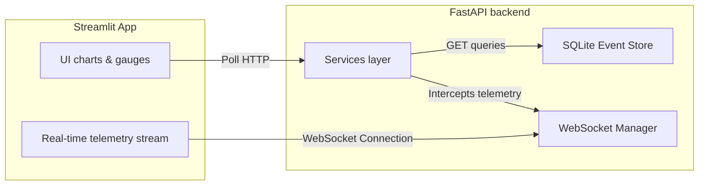
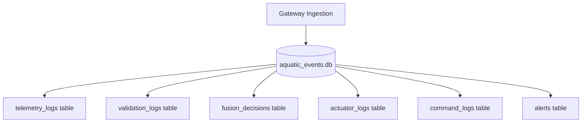

# System Architecture and Diagrams

This document details the architectural design and software execution flows of the integrated capstone system using Mermaid diagrams.

---

## 1. Complete System Architecture

---

## 2. ML/AIS Parallel Architecture

---

## 3. ESP32 Finite State Machine

---

## 4. MQTT Communication Flow

---

## 5. Gateway Inference Flow

---

## 6. Fusion Decision Flow

---

## 7. Backend and Dashboard Flow

---

## 8. Database Persistence Flow

