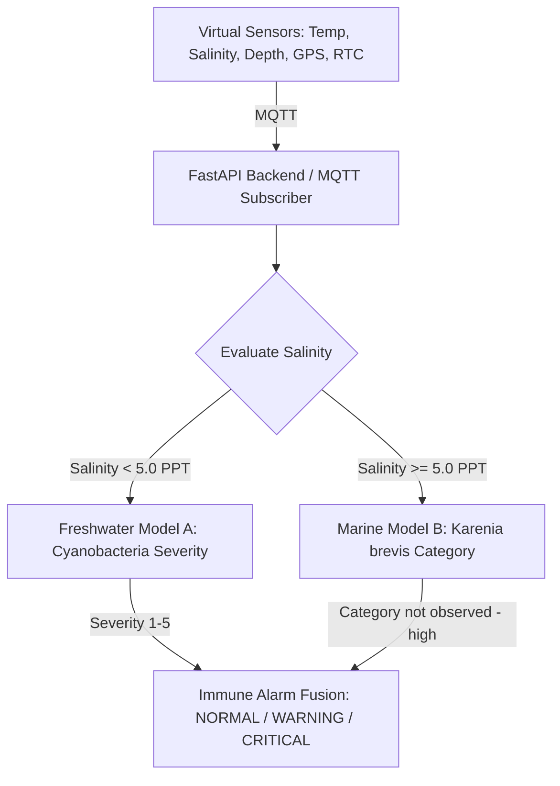

# IoT Feature Alignment Report

This document maps historical dataset columns to the sensors and data fields that will be generated by our virtual Embedded/IoT systems (such as ESP32 nodes) during live real-time simulation.

---

## 1. Feature Mapping Matrix

| Historical Feature | ML Input Feature Name | Virtual IoT Sensor Source | Unit | Used by ML Model | Reason / Verification |
| --- | --- | --- | --- | --- | --- |
| `lat` / `LATITUDE` | `lat` / `LATITUDE` | GPS Module (Simulated) | Decimal Degrees | **YES** | Anchors the spatial risk pool for the prediction routing. |
| `lon` / `LONGITUDE` | `lon` / `LONGITUDE` | GPS Module (Simulated) | Decimal Degrees | **YES** | Anchors the spatial risk pool for the prediction routing. |
| `WATER_TEMP` | `WATER_TEMP` | DS18B20 Temp Sensor | Celsius | **YES** | Thermal threshold for dinoflagellate (*Karenia brevis*) reproduction. |
| `SALINITY` | `SALINITY` | Conductivity/Salinity Sensor | Parts Per Thousand (PPT) | **YES** | Distinguishes freshwater from coastal marine ecosystems. |
| `SAMPLE_DEPTH` | `SAMPLE_DEPTH` | Pressure/Depth Sensor | Meters | **YES** | Monitors the vertical concentration in the water column. |
| `Month` (Date) | `Month_sin`, `Month_cos` | RTC (Real Time Clock) | Sine/Cosine | **YES** | Captures seasonal cycle (blooms peak in late summer/autumn). |
| `distance_to_water_m` | `distance_to_water_m` | GIS Database Lookup | Meters | **YES** | Used only in Freshwater Model (Model A). Constant for fixed station. |
| None | `pH` | pH Sensor (Simulated) | pH Units | **NO** | Absent in historical datasets. Simulator will report it, but ML model will ignore. |
| None | `Turbidity` | Turbidity Sensor (Simulated)| NTU | **NO** | Absent in historical datasets. Simulator will report it, but ML model will ignore. |
| None | `Dissolved_Oxygen`| DO Probe (Simulated) | mg/L | **NO** | Absent in historical datasets. Simulator will report it, but ML model will ignore. |

---

## 2. Dynamic Routing Logic (Salinity Gateway)

The virtual IoT station will publish environmental readings to an MQTT broker. The Python backend will parse these values and dynamically select the prediction model using **Salinity**:

### Future Multimodal CV Alignment:
If image datasets (such as algae micrographs) are integrated later, the pipeline can be extended:
1.  **Image stream:** Captured by a virtual camera node $\rightarrow$ processed by a **YOLO/CNN** model to count algae cells.
2.  **Sensors stream:** Processed by the tabular ML models.
3.  **Multimodal Fusion:** Fuses visual cell counts and sensor-based risk categories into the final AIS decision layer.
