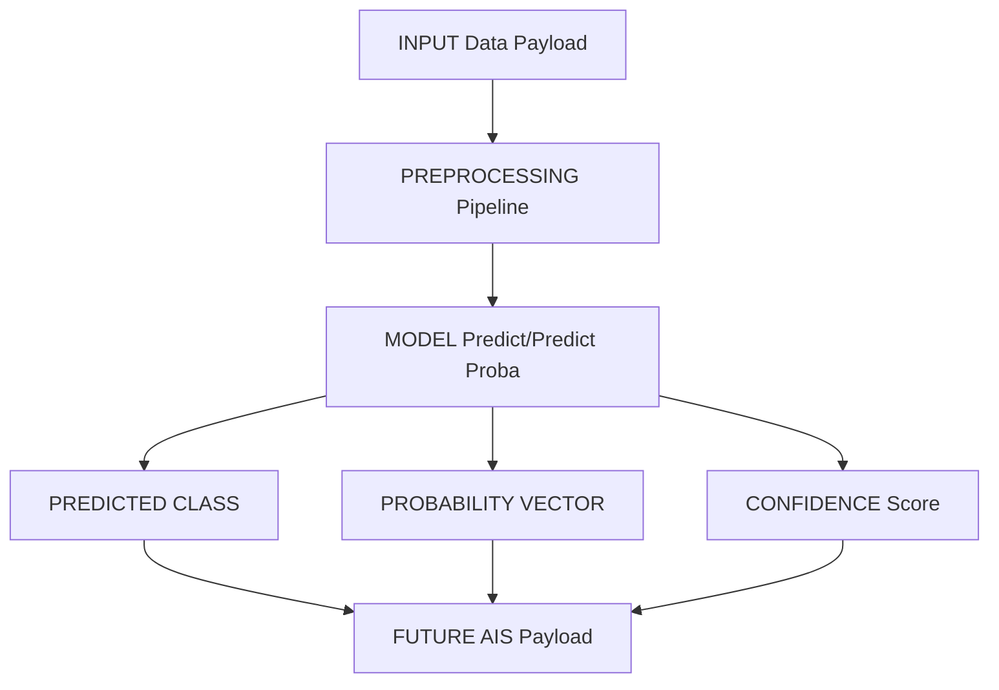

# Final Inference Contract

This document defines the formal data and execution contract for the CAML and HABSOS models. The future Artificial Immune System (AIS) and IoT backend must strictly adhere to this contract when running inference.

---

## 1. CAML Inference Contract (Freshwater Bloom Severity)

### Feature Interface
*   **Required Input Fields:**
    *   `lat` (float): Latitude of the water sample location.
    *   `lon` (float): Longitude of the water sample location.
    *   `distance_to_water_m` (float): Geographic distance to the nearest water body in meters.
    *   `region` (string): Regional code (e.g., `'FL'`).
    *   `Season` (string): Season designation (`'Spring'`, `'Summer'`, `'Autumn'`, `'Winter'`).
    *   `Year` (int/float): Chronological year of the sample.
    *   `Month_sin` (float): Sine transformation of the month index.
    *   `Month_cos` (float): Cosine transformation of the month index.
    *   `DayOfYear_sin` (float): Sine transformation of the day of year.
    *   `DayOfYear_cos` (float): Cosine transformation of the day of year.
*   **Optional Fields:**
    *   `date` or `time` (unused, dropped automatically during preprocessing).
*   **Rejected Fields:**
    *   `abun` (cyanobacteria abundance in cells/L) is **strictly rejected** as an input feature to prevent target leakage.

### Preprocessing Behavior
*   **Imputation:** Global median imputation using training set medians (`SimpleImputer(strategy='median')`).
*   **Scaling:** Z-score normalization (`StandardScaler`) applied to all numeric columns.
*   **Categorical Encoding:** One-hot encoding (`OneHotEncoder(handle_unknown='ignore', sparse_output=False)`) for `region` and `Season`.
*   **Remainder Columns:** Any unlisted columns in inputs are dropped dynamically.

### Prediction & Probability Ordering
*   **Output Class Labels:** Integer severity levels `[1, 2, 3, 4, 5]`.
*   **Probability Ordering:** The array of shape `(1, 5)` returned by `predict_proba` aligns with the index representation:
    *   `Index 0`: Probability of Severity Class `1` (None/Low)
    *   `Index 1`: Probability of Severity Class `2` (Low-Medium)
    *   `Index 2`: Probability of Severity Class `3` (Medium)
    *   `Index 3`: Probability of Severity Class `4` (High)
    *   `Index 4`: Probability of Severity Class `5` (Extreme)
*   **Confidence Definition:** The probability of the predicted class (i.e. `max(predict_proba)`).
*   **Dangerous Classes:** Classes `4` and `5` (High and Extreme). If the predicted class is `4` or `5`, a safety alert must be raised.

### Missing-Value Behavior
*   If numeric fields are missing, they will be filled with the global median calculated during training.
*   If categorical fields (`region`, `Season`) contain missing or unknown categories, they are ignored by the OneHotEncoder (all one-hot columns for that categorical variable will be `0.0`).

---

## 2. HABSOS Inference Contract (Marine HAB Threat Level)

### Feature Interface
*   **Required Input Fields:**
    *   `LATITUDE` (float): Latitude of the marine water sample.
    *   `LONGITUDE` (float): Longitude of the marine water sample.
    *   `STATE_ID` (string): State abbreviation (e.g., `'FL'`, `'TX'`).
    *   `SAMPLE_DEPTH` (float): Sample depth in meters.
    *   `SALINITY` (float): Salinity measurement of the water.
    *   `WATER_TEMP` (float): Water temperature in degrees Celsius.
    *   `Season` (string): Season designation (`'Spring'`, `'Summer'`, `'Autumn'`, `'Winter'`).
    *   `Year` (int/float): Chronological year of the sample.
    *   `Month` (float): Numerical month (1.0 to 12.0) used for grouping-based imputation.
    *   `Month_sin` (float): Sine transformation of the month index.
    *   `Month_cos` (float): Cosine transformation of the month index.
    *   `DayOfYear_sin` (float): Sine transformation of the day of year.
    *   `DayOfYear_cos` (float): Cosine transformation of the day of year.
*   **Optional Fields:**
    *   None.
*   **Rejected Fields:**
    *   `abun` or `CATEGORY` (target field).

### Preprocessing Behavior
*   **Depth Imputation:** Missing `SAMPLE_DEPTH` is imputed with `0.0` (representing surface level).
*   **Salinity & Temperature Imputation:** Handled by `GroupMedianImputer`:
    1. Primary: Median of `STATE_ID` + `Month` group.
    2. Fallback: Median of `STATE_ID`.
    3. Global: Median of training set.
    4. Two indicators (`SALINITY_is_missing`, `WATER_TEMP_is_missing`) are dynamically appended as `1.0` or `0.0` to denote whether imputation occurred.
*   **Scaling:** Z-score normalization (`StandardScaler`) applied to all numerical columns, including the two missingness indicators.
*   **Categorical Encoding:** One-hot encoding (`OneHotEncoder(handle_unknown='ignore', sparse_output=False)`) for `STATE_ID` and `Season`.

### Prediction & Probability Ordering
*   **Output Class Labels:** String categories `['critical', 'normal', 'warning']`.
*   **Probability Ordering:** The array of shape `(1, 3)` returned by `predict_proba` is sorted **alphabetically**:
    *   `Index 0`: Probability of `'critical'`
    *   `Index 1`: Probability of `'normal'`
    *   `Index 2`: Probability of `'warning'`
*   **Confidence Definition:** The probability of the predicted class (i.e. `max(predict_proba)`).
*   **Dangerous Classes:** Categories `'warning'` and `'critical'`. If the predicted class is `'warning'` or `'critical'`, a safety alert must be raised.

### Missing-Value Behavior
*   If `SAMPLE_DEPTH` is missing, it defaults to `0.0`.
*   If `SALINITY` or `WATER_TEMP` are missing, they are imputed using group-level medians.
*   If other variables are missing, standard behavior is fallback to global medians, while unknown categories map to zeroed one-hot arrays.
